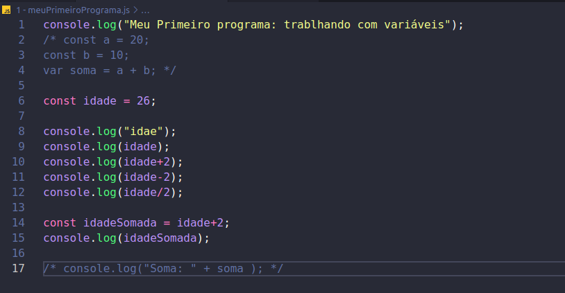

## Curso de JavaScript: explorando a linguagem

**Faça esse curso de JavaScript e:**

- Execute código JS em sua máquina

- Aprenda a usar o VSCode e seu Debbuger

- Saiba como funciona variáveis, controle de fluxo, condicionais e laços de repetição

- Conheças os tipos básicos dentro do JS

### 01. Introdução a linguagem

O que aprendemos nessa aula:

- Usando o REPL no NodeJS

- Como imprimir valores na tela

- Declaração de variáveis

- Operadores aritméticos

**Arquivos:** 1 a 3 

### 02. Tipos de variáveis 

O que aprendemos nessa aula:

- Const e let

- Case Sensitive

- Adicionando comentários

- parseInt e parseFloat

- Usando números com casa decimal

- Atribuição de variáveis

**Arquivos:** 4 e 5 

### 03. Trabalhando com muitos elementos

O que aprendemos nessa aula:

- Criação de Arrays;

- Inserção de itens em um array;

- Array splice;

- Palavras reservadas;

- Indices do array;

**Arquivos:** 5 e 6

### 04. Condicionais e fluxo de execução

O que aprendemos nessa aula:

- If e Else

- Operadores lógicos

- if encadeado

- else if

- && e ||

### 05. Iterando sobre coleções

O que aprendemos nessa aula:

- While;

- Break;

- Usando o Debbuger do VS Code;

- Entendendo o fluxo de execução do código;

- configurando o debbuger do VSCode;

- For Loop;